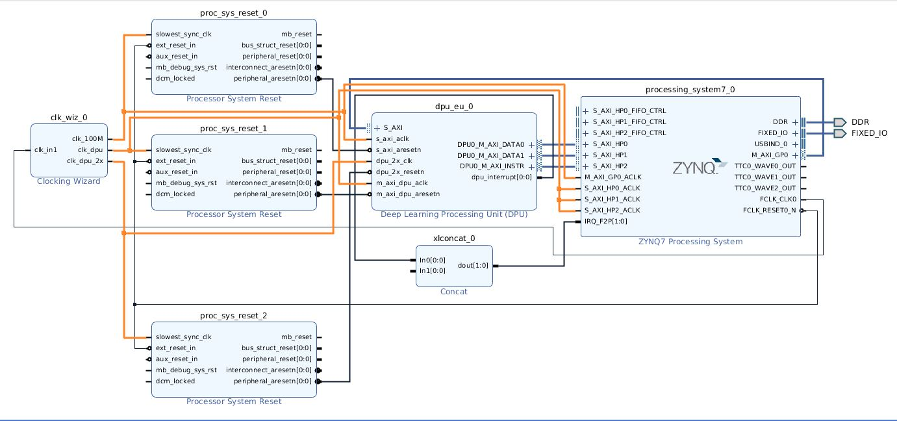
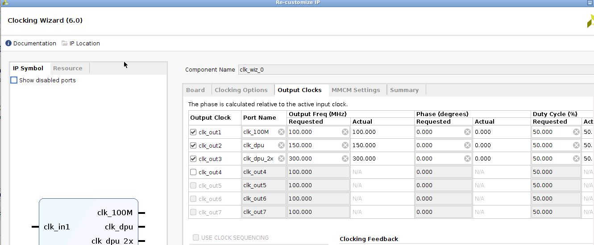
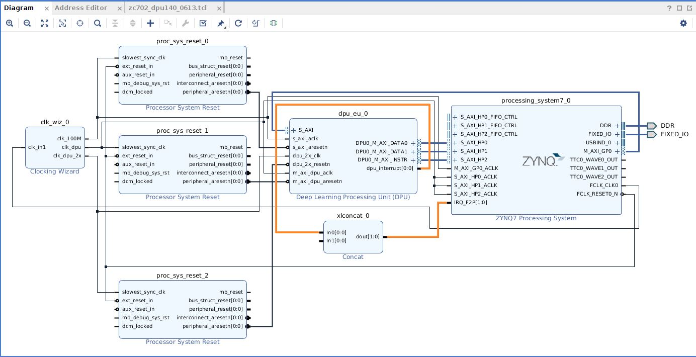
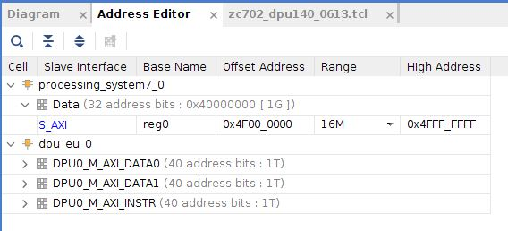

# Quick guide for create DPU on ZC702 from scratch

## Recipes
- Vivado 2018.3
- Petalinux 2018.3
- Xilinx DPU v1.4.0
- xilinx-zc702-v2018.3-final.bsp


Please refer to PG338 and UG1350 DPU Integration Tutorial@Github

Since the DPU version and Boards different used in the documentation above, the steps should be some
changed for this target design. So write down this quick guide and will highlite the key ponits.

## Steps

### Vivado IPI
The DPU v1.4.0 is the unified version to support Zynq and Zynq MPSoC. I just put one DPU 1152 on ZC702
since the limitation resource on XC7Z020-CLG484-1.

The details in step by step can refer to PG338 and here just some highlight attentions.
- S_AXI Clock @ 100MHz
- M_AXI Clock @ 150MHz for DPU and Clock @ 300MHz for DPU DSP
- DPU IRQ connect to IRQ_F2P[0]
- DPU S_AXI address set 0x4F000000 - 0x4FFFFFFF(16M)

The project and bd tcl provide for recreating the Vivado project.

Here are the snapshot images to help you do the IPI.
- DPU Clock Connect
- DPU Clock Source Settings
- DPU Interrupt Connect
- DPU Register Address

Suppose you export the HDF file named as zc702_dpu140_design1_wrapper.hdf.

**QUICK WAY**
Use the bd tcl(./vivado/zc702_dpu140_bd_0613.tcl) to re-create the design. Other files in ./vivado will give more help.

### Petalinux
You may export the HDF(zc702_dpu_140_d1_wrapper.hdf) from Vivado projcet to Petalinux project here.

1. Create the project
```
$petalinux-create -t project -s BSP/xilinx-zc702-v2018.3-final.bsp -n zc702-dpu140-trd
```
2. Import HDF
```
$cd zc702-dpu140-trd
$petalinux-config --get-hw-description=[PATH to vivado HDF file]
```
3. Set SD rootfs mode
Petalinux-config Menu run auto after imported HDF. Please set SD rootfs by,
Image Packaging Configuration --> Root filesystem type (SD card) --> SD card

**NOTE** Petalinux use INITRAMFS within image.ub and BOOT.bin in one SD partition as default. But run DPU
Application may depend on multiple 3rd libs like OpenCV need very large space but limited by the INITRAMFS.
So we suggest use at least 16G SD card and format it with two partitions. The 1st partition is FAT32 should
enough for put BOOT.bin and image.ub that 128Mb shoulbe be good. Other space go to 2nd partition in Ext4.

4. Copy files from [DPU Integration Tutorial](https://github.com/Xilinx/Edge-AI-Platform-Tutorials/tree/master/docs/DPU-Integration) of Edge-AI-Platform-Tutorials 

Let's borrow some files for petalinux from Github project Edge-AI-Platform_tutorials (Step 2).
The files are in ./Edge-AI-Platform-Tutorials/docs/DPU-Integration/reference-files/files.

Skip the steps 1,2,4,8 about OpenCV v3.1/protobuf/DNNDK runtime/

Same steps 3,5,6,7
- Add a bbappend to modify the LINUX_VERSION_EXTENTSION
- Add a recipe to build DPU driver kernel module
- Auto load DPU module


5. Config rootfs
Add the following lines to ./project-spec/meta-user/recipes-core/images/petalinux-image-full.bbappend

```
IMAGE_INSTALL_append = " dpu"
```

```
$petalinu-config -c rootfs
```

Add these bellow.
```
Filesystem Packages ->
console -> utils -> pkgconfig -> pkgconfig
Petalinux Package Groups ->
petalinuxgroup-petalinux-opencv
petalinuxgroup-petalinux-opencv-dev
petalinuxgroup-petalinux-v4lutils
petalinuxgroup-petalinux-v4lutils-dev
petalinuxgroup-petalinux-self-hosted
petalinuxgroup-petalinux-self-hosted-dev
petalinuxgroup-petalinux-x11

Apps -> autostart

Modules -> dpu
```

6. Device-tree
The device-tree generator create the pl.dtsi for PL device.
It is ./components/plnx_workspace/device-tree/device-tree/pl.dtsi

```
/*
 * CAUTION: This file is automatically generated by Xilinx.
 * Version:  
 * Today is: Thu Jun 13 03:34:45 2019
 */


/ {
	amba_pl: amba_pl {
		#address-cells = <1>;
		#size-cells = <1>;
		compatible = "simple-bus";
		ranges ;
		dpu_eu_0: dpu_eu@4f000000 {
			clock-names = "s_axi_aclk", "dpu_2x_clk", "m_axi_dpu_aclk";
			clocks = <&misc_clk_0>, <&misc_clk_1>, <&misc_clk_2>;
			compatible = "xlnx,dpu-eu-2.0";
			interrupt-names = "dpu_interrupt";
			interrupt-parent = <&intc>;
			interrupts = <0 29 4>;
			reg = <0x4f000000 0x1000000>;
		};
		misc_clk_0: misc_clk_0 {
			#clock-cells = <0>;
			clock-frequency = <100000000>;
			compatible = "fixed-clock";
		};
		misc_clk_1: misc_clk_1 {
			#clock-cells = <0>;
			clock-frequency = <300000000>;
			compatible = "fixed-clock";
		};
		misc_clk_2: misc_clk_2 {
			#clock-cells = <0>;
			clock-frequency = <150000000>;
			compatible = "fixed-clock";
		};
	};
};
```

Modify the ./project-spec/meta-user/recipes-bsp/device-tree/files/system-user.dtsi to compatible with the
DPU driver.

```
/include/ "system-conf.dtsi"
/ {
};

&dpu_eu_0{
        compatible = "xilinx,dpu";
};
```

Another way what I used to modify the DPU source code to compatible with the pl.dtsi.
The source code is ./project-spec/meta-user/recipes-modules/dpu/files/dpucore.c


7. Build Petalinux image

```
$petalinux-build
$petalinux-package --boot --fsbl ./images/linux/zynq_fsbl.elf --fpga ./images/linux/system.bit --u-boot
```

**QUICK WAY**
The BSP file in ./petalinux/bsp/zc702_dpu140_trd.bsp will give a fast easy way replace all the steps above
to create the petalinux project.

```
$petalinux-create -t project -s BSP/zc702_dpu140_trd.bsp -n zc702-dpu140-trd
$petalinux-build
$petalinux-package --boot --fsbl ./images/linux/zynq_fsbl.elf --fpga ./images/linux/system.bit --u-boot
```

### Boot the linux image
- Prepare SD card with two partions. The first is BOOT partioin in FAT32 and the second is ROOTFS partion in ext4.
- Copy images files to SD card(BOOT.bin and image.ub to BOOT partion and extract rootfs.tar.bz2 into ROOTFS partion.)
- Boot the zc702 with this image

**QUICK WAY**
The prebuilt linux image files are in ./petalinux/images/

### Install DNNDK runtime and bin
- ssh to the zc702
- copy ./zynq7020_dnndk_v3.0 to /home/root/ of zc702
- install it by run the ./zynq7020_dnndk_v3.0/install.sh

### Check the DPU and DNNDK runtime
```
root@xilinx-zc702-2018_3:~# dexplorer -w
[DPU IP Spec]
IP  Timestamp   : 2019-06-13 17:30:00
DPU Core Count  : 1

[DPU Core List]
DPU Core        : #0
DPU Enabled     : Yes
DPU Arch        : B1152F
DPU Target      : v1.4.0
DPU Freqency    : 150 MHz
DPU Features    : Avg-Pooling, LeakyReLU/ReLU6, Depthwise Conv
root@xilinx-zc702-2018_3:~# lsmod
    Tainted: G
dpu 40960 0 - Live 0xbf018000 (O)
uio_pdrv_genirq 16384 0 - Live 0xbf000000

root@xilinx-zc702-2018_3:~# dexplorer -v
DNNDK version  3.0
Copyright @ 2018-2019 Xilinx Inc. All Rights Reserved.

DExplorer version 1.5
Build Label: May 24 2019 08:19:39

DSight version 1.4
Build Label: May 24 2019 08:19:39

N2Cube Core library version 2.3
Build Label: May 24 2019 08:19:49

DPU Driver version 2.2.0
Build Label: Jun 13 2019 03:37:39

```


### Run the yolov3 applications
- ssh to the zc702
- copy the ./apps to the /home/root/ zc702
There are two yolov3 model. The zc702_yolov3 is original model and zc702_yolov3_8g is the pruned model. Each has one bin
named yolo can run at zc702
- Test the performance in multiple thread by run './yolo 4 p'
The zc702_yolov3 can get FPS=2 as well as zc702_yolov3_8g get FPS=14.
- Test inference image in zc702_yolov3
- ssh to zc702 and enable X11 forword.(Advice use mobaxterm in HOST Windows OS which auto-enable X11 forword in default)
```
./yolo ./image i'
```
The result image window will pop up in HOST Window OS.


## Reference
- [PG338](https://www.xilinx.com/products/design-tools/ai-inference/ai-developer-hub.html)
- [UG1350](https://github.com/Xilinx/Edge-AI-Platform-Tutorials/tree/master/docs/DPU-Integration)


